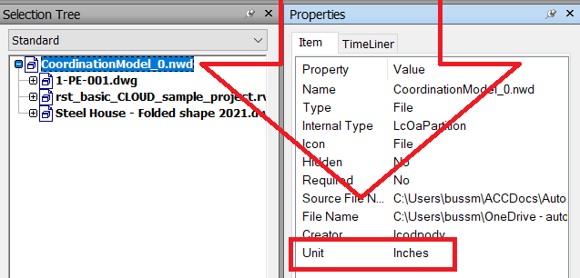

# NW-HideByCoords (Proof-of-Concept, sample code, use at own risk):
"Splits" a Navisworks model by creating copies of the model with just certain part of the model being visible. This is for use on the BIM 360 viewer.

# Installation:

# Usage:

<i>Example:</i>

"D:\Program Files\Autodesk\Navisworks Manage 2020\Roamer.exe" -NoGui -OpenFile "D:\Downloads\Modelle\RVT_P3D_AS.nwd" -ExecuteAddInPlugin "HideByCoords.AHideByCoords.ADSK" "D:\Downloads\Modelle\RVT_P3D_AS_mod.nwd" neg15.668 9.754 2.897 neg10.668 14.754 7.897

<i>Details:</i>

Roamer.exe -NoGui -OpenFile (Input Navisworks File) -ExecuteAddInPlugin "HideByCoords.AHideByCoords.ADSK" (Output Navisworks Copy with parts are hidden) MinX MinY MinZ MaxX MaxY MaxZ

MinX MinY MinZ are the coordinates of the lower edge of the cube to be respected as a part selection area for the parts to be displayed (all parts inside of or touching the cube)

MaxX MaxY MaxZ are the coordinates of the upper edge of the cube with MaxX > MinX, MaxY > MinY, MaxZ > MinZ

<b>You cannot use the Minus for the Numbers, you need to write negative numbers like this: neg15.668 instead of -15.668</b>

<b>You need to respect the Windows Regional Format for the number input, e.g. on a machine with German Regional Format you need to type 15,668 instead of 15.668</b>

Tip: with this AutoCAD tool (https://github.com/Henaccount/ClipBox-ACAD-NW) using the command: "ClipBoxNwWriteBatchOnly", you can speed up the creation of the batch file. Just select the boxes that you created in AutoCAD (using your NW model as xref) and execute the command. As a result you will see the coordinates in the "clipboxnw.bat" in meters in your documents folder. If your NWD model has different units, you need to convert the coordinates accordingly (correct also pathing and script call in the bat file).

