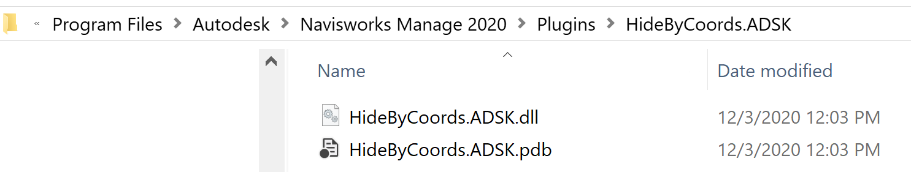

# NW-HideByCoords:
"Splits" a Navisworks model by creating copies of the model with just certain part of the model being visible. This is for use on the BIM 360 viewer.

# Installation:

# Usage:

<u>Example:</u>

"D:\Program Files\Autodesk\Navisworks Manage 2020\Roamer.exe" -NoGui -OpenFile "D:\Downloads\Modelle\RVT_P3D_AS.nwd" -ExecuteAddInPlugin "HideByCoords.AHideByCoords.ADSK" "D:\Downloads\Modelle\RVT_P3D_AS_mod.nwd" neg15.668 9.754 neg2.897 10.668 14.754 7.897

<u>Details:</u>

Roamer.exe -NoGui -OpenFile (Input Navisworks File) -ExecuteAddInPlugin "HideByCoords.AHideByCoords.ADSK" (Output Navisworks Copy with parts are hidden) MinX MinY MinZ MaxX MaxY MaxZ

MinX MinY MinZ are the coordinates of the lower edge of the cube to be respected as a part selection area for the parts to be displayed (all parts inside of or touching the cube)

MaxX MaxY MaxZ are the coordinates of the upper edge of the cube with MaxX > MinX, MaxY > MinY, MaxZ > MinZ

<b>You cannot use the Minus for the Numbers, you need to write negative numbers like this: neg15.668 instead of -15.668</b>

